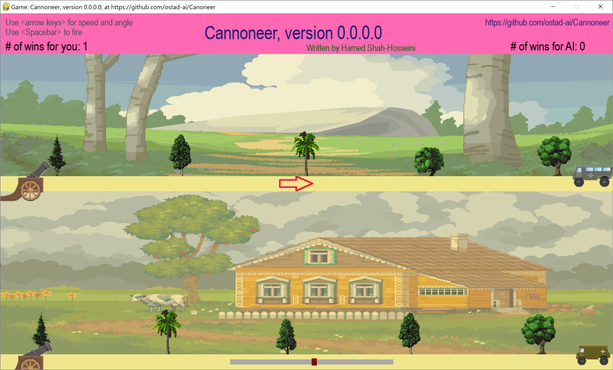

# Cannoneer
You have a cannon and a target. Your competitor is an AI-based algorithm. You should aim carefully to win the AI-cannoneer. The one who shoots their target first is the winner.
### First version: version 0.0.0.0
1. Use **Arrow keys** to change the *speed* of the cannon ball, and *orientation* of the cannon.
2. Use the **Spacebar** key to fire the cannon.
3. The game has some special effects like *smoke* and *explosion*.
## This archive includes the executable program: **cannoneer.exe**, which is suitable for **Windows 10** and over. You should click on the executable to run.
[Download the archive for win64](https://drive.google.com/file/d/16JvVxDYcD4DzAJhl8CRlaT45etccicil/view?usp=sharing)
---
 *Figure 1: A snapshot of Cannoneer Game, version 0.0.0.0, while playing the game.*
---
